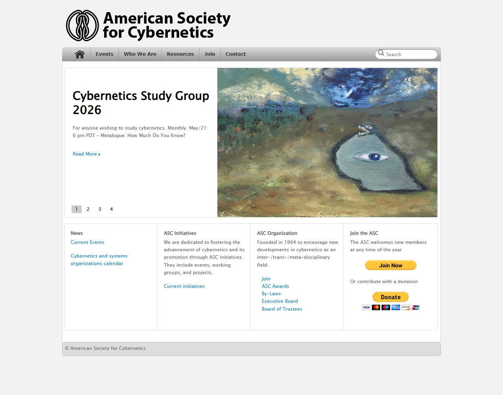
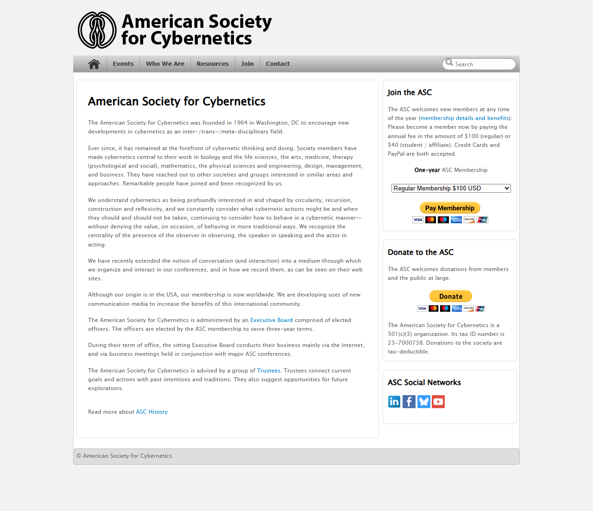
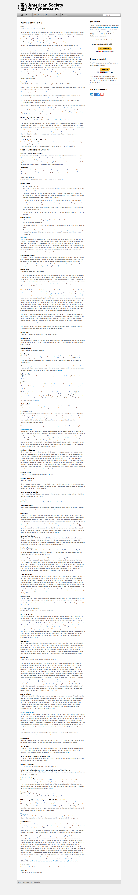
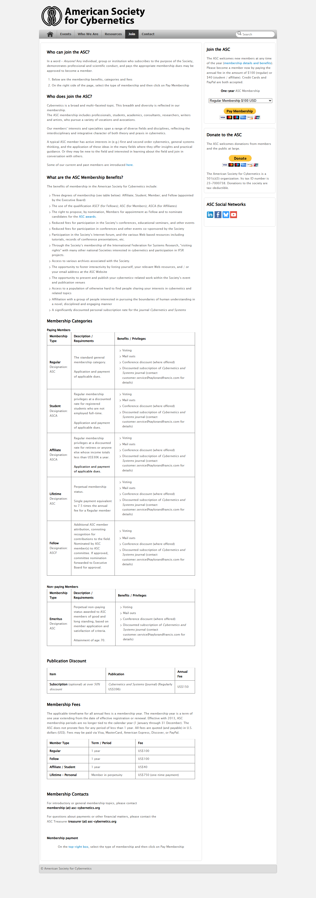
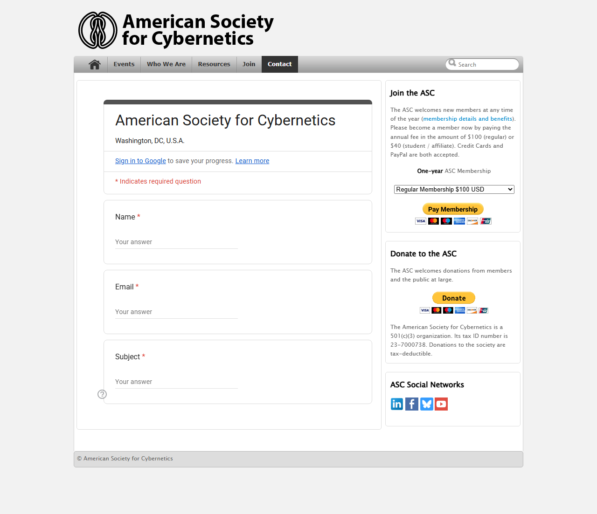

# Comprehensive Website Audit and Existing Conditions Report
**Target Website:** [American Society for Cybernetics (ASC)](https://asc-cybernetics.org/)  
**Date of Audit:** May 24, 2026  
**Auditor:** Antigravity (Advanced AI Systems Engineer)  
**Document Status:** Final Audit of Existing Conditions  

---

## 1. Executive Summary

This report delivers a rigorous, objective audit of the existing conditions of the **American Society for Cybernetics (ASC)** website located at [https://asc-cybernetics.org/](https://asc-cybernetics.org/). The primary objective is to document, map, and catalog the current visual layouts, content structure, integrations, page assets, and legacy codebase configurations of the live site as it operates today. 

By capturing a rich, highly detailed understanding of the current states, this document serves as the absolute functional baseline for the ASC site. It outlines exactly "what is there now" so that any future refactoring initiatives can proceed with complete technical fidelity.

---

## 2. Technical Stack and Codebase Configuration

An examination of the live site's source markup, HTTP response headers, and script assets reveals the following operational technical stack:

### 2.1. Core Platform & Doctype
*   **Content Management System**: WordPress (rendered version `6.9.4` or custom core variant).
*   **Doctype Standard**: Compiled under the legacy **XHTML 1.0 Transitional** standard:
    ```html
    <!DOCTYPE html PUBLIC "-//W3C//DTD XHTML 1.0 Transitional//EN" "http://www.w3.org/TR/xhtml1/DTD/xhtml1-transitional.dtd">
    <html xmlns="http://www.w3.org/1999/xhtml" lang="en-US">
    ```
    This Doctype structure precedes modern HTML5 standards, meaning the site lacks native support for structural semantic markup elements like `<main>`, `<section>`, `<article>`, `<header>`, or `<nav>`.

### 2.2. CSS and Styling System
*   **Active WordPress Theme**: `ApplicationPro` (stored in `/wp-content/themes/ApplicationPro/`).
*   **Primary Stylesheet**: Loaded from `https://asc-cybernetics.org/wp-content/themes/ApplicationPro/style.css`.
*   **Custom Styling Layers**: Embedded inline styling overrides inside the `<head>` tag under `#wp-custom-css`:
    ```css
    table {border: none;}
    #searchsubmit { padding: 6px; }
    #footer-desc { visibility: hidden; }
    #footer-desc:after {
        visibility: visible;
        position: absolute;
        padding: 6px;
        padding-top: 6px;
        content: "© American Society for Cybernetics"
    }
    ```
*   **Layout Engine**: Rigorous float-based system utilizing rigid container widths (split into a `#left-col` of 640px and a `#right-col` sidebar of 300px).

### 2.3. Frontend Script Library Dependencies
The website relies on several legacy JavaScript libraries to handle visual transitions, menus, and carousels:
*   **jQuery Core**: v3.7.1 and migration helper v3.4.1 (loaded synchronously in the header).
*   **Superfish**: `superfish.js` v1.0 (used to generate multi-level dropdown effects for the main navigation).
*   **jQuery Cycle**: `jquery.cycle.all.js` v1.0 (handles the homepage banner carousel transitions).
*   **Easing**: `jquery.easing.1.3.js` (provides transitional animation curves for carousels).

### 2.4. Third-Party Integrations
*   **Analytics**: Integrated via Google Tag Manager and GA4 (`GT-T5R7L5H`) inserted via the Google Site Kit WordPress plugin.
*   **Payments & E-Commerce**:
    *   **Sidebar Membership Checkout**: Standard HTML form executing an off-site POST request to the legacy PayPal processing engine:
        ```html
        <form action="https://www.paypal.com/cgi-bin/webscr" method="post" target="_top">
        ```
        This relies on hidden input values mapping to Hosted Button ID `VBTE3UGQ57BZW` and standard text dropdown variables (`os0`, `os1`) for Membership Type.
    *   **Donations Widget**: Standard HTML form mapping to Hosted Button ID `F9WYEWP9R8N3J`.
    *   **Paypal Hosted Buttons Script**: Synced on March 1, 2024, running `paypal.HostedButtons` targeting container `#paypal-container-7ASV2L7DHJ2ZJ`.
*   **Inquiry Processing**: Contact requests are handled by embedding an external Google Form within a standard iframe container:
    ```html
    <iframe src="https://docs.google.com/forms/d/e/1FAIpQLSdvlUpE1tcHXc0oXVOgwwBB-oCn72LDG-_YEQhqr2YGevo6Wg/viewform?embedded=true" width="640" height="673" ...>
    ```

---

## 3. Information Architecture and Layout Templates

The sitemap and navigation map are structured hierarchically under five primary header pathways, a global search component, and sidebars.

### 3.1. Page Layout Structures
1.  **Split Column Template (Sidebar Enabled)**:
    *   *Usage*: Home, About Us, Join, Definitions, Journals, Contact.
    *   *Grid Structure*: Wrapper block (`#wrapper`) containing `#header` (logo image), `.menubar` (navigation elements), `#content` container housing a left column (`#left-col`) for the main content body, and a right column (`#right-col`) acting as the global sidebar widget block.
2.  **Fullwidth Template (Sidebar Disabled)**:
    *   *Usage*: Initiatives, Executive Board, Calendar.
    *   *Grid Structure*: Utilizes `#content-fullwidth` enclosing `#post-entry-fullwidth` to span the entire 960px design canvas, removing the right-hand widget sidebar.

---

## 4. Page-by-Page Audit and Feature Catalog

### 4.1. Home Page (`/`)
The entry portal to the ASC presents high-level slides and navigational shortcuts to the core sectors of the organization.



*   **Primary Features**:
    *   **Slideshow Carousel**: Built using `jquery.cycle.all.js`. Automatically transitions between three active slides:
        1.  *Cybernetics Study Group 2026* (links to Study Group page; highlights the monthly metalogue series).
        2.  *ASC Conference 2026: Conversational Confluences* (links to external subdomain `https://events.asc-cybernetics.org/2026/`).
        3.  *Speaker Series 6#9: Dear AI Reader* (links to Speaker Series subpage).
    *   **Search Form**: Integrated into `#search-header` submitting search parameters via a GET request (`/?s=...`).
    *   **Information Box Grid**: A four-column visual grid block at the bottom of the home content:
        *   *News*: Promotes current events and calendars.
        *   *ASC Initiatives*: Introduces workgroups and project goals.
        *   *ASC Organization*: Fast links to board members, trustees, awards, and by-laws.
        *   *Join the ASC*: Explains membership options with direct link anchors.
    *   **PayPal Sidebar Widget**: Present on the right column `#sidebar`, containing standard dropdown elements for selecting "Regular Membership" ($100) or "Student/Affiliate Membership" ($40), triggering an external payment screen.

---

### 4.2. About Us Page (`/about/`)
A long-form, two-column biographical and organizational overview page detailing the history and structure of the society.



*   **Primary Features**:
    *   **Narrative Profile**: Outlines the founding in 1964 in Washington, DC, the interdisciplinary work of the members across design, mathematics, arts, and biological sciences, and the society's focus on second-order cybernetic principles (circularity, construction, reflexivity).
    *   **Administration Map**: Explains the hierarchy of the Executive Board (officers serving 3-year terms) and the role of the Trustees (preserving history and advising future paths).
    *   **Integrated Links**: Connects directly to the executive board roster, trustees list, and full history documents.

---

### 4.3. Events (`/events/` & Subpages)
Comprises the central event calendars, upcoming workshops, and historical records.
*   **Primary Features**:
    *   **ASC 2026 Conference Section**: Spotlights the upcoming conference *Conversational Confluences* (August 3–7, 2026, in Ouro Preto, Brazil). Explains the conceptual theme of "confluence" inspired by Brazilian thinker Nego Bispo (coexistence of diverse worldviews without homogenization).
    *   **Speaker Series Listing**: Details on Season #6 ("Emergent Territories") held on the 3rd Sunday of each month, featuring virtual dialogues across various formats (interviews, panel discussions).
    *   **New Macy Meetings Index**: Explains the #NewMacyMeetings initiative as a trans-global, trans-generational revival of the original 1940s-1950s founding Macy Meetings.
    *   **Sub-navigation**: Links directly to the virtual systems calendar (`/calendar/`) and the past events archive (`/past-events/`).

---

### 4.4. Initiatives Page (`/initiatives/`)
A fullwidth layout cataloging the active projects, study circles, and workgroups running within the society.
*   **Primary Features**:
    *   **Detailed Listings**:
        *   *Speakers Series*: Season #6 ("Emergent Territories").
        *   *#NewMacyMeetings*: Historical trans-disciplinary revival operations.
        *   *Archives Working Group*: Initiatives geared toward gathering, managing, and indexing global cybernetic archival assets.
        *   *Art, Media, and Cybernetics (AMC) Working Group*: Collaborative panel series connecting students, researchers, and creators.
        *   *ASC Study Group*: Curious virtual group reading Bateson's metalogues.
    *   **Navigation Nodes**: All listings include dedicated button anchors linking to custom sub-pages (e.g., `/amc/` or `/initiatives/asc-study-group-2026/`).

---

### 4.5. Executive Board Page (`/executive-board/`)
A fullwidth list cataloging the profiles of the active board of directors alongside historical past presidents.
*   **Primary Features**:
    *   **Active Officers List (Term 2024-2026)**:
        *   *President*: Paul Pangaro, PhD
        *   *Vice President*: Claudia Westermann, PhD
        *   *Treasurer*: Laura Ehmann, MA
        *   *VP Electronic Publications*: Pedro (Adler) Looks Jorge, MSc, M.Design
        *   *VP Membership*: Art Collings, MA
        *   *Members At-large*: Daniel Rosenberg Muñoz, PhD; Iannis (John) Bardakos; José Cabral Filho, MArch, PhD; Jocelyn Chapman, PhD; Patricia Ticineto Clough, PhD; Juliana Mariano Alves, PhD; Michael Munton, MA; Mateus van Stralen, PhD; Shantanu Tilak, PhD; Allenna Leonard, PhD.
    *   **Biographical Bios**: Each member profile contains a narrative detailing their academic background, corporate/research roles, and their specific entry point and relationship to cybernetics theory.
    *   **Past Presidents Table**: A chronological text table listing all presidents since 1964, tracking the society's historical leadership lineage.

---

### 4.6. Definitions of Cybernetics Page (`/definitions/`)
An extensive scholarly compendium detailing the historical definitions of the field.



*   **Primary Features**:
    *   **Theoretical Compilation**: Curated narrative compiled by Stuart Umpleby (1982/2000) and Larry Richards (1987).
    *   **Authors Indexed**: Features specific philosophical and mathematical quotes from:
        *   *Norbert Wiener*: "control and communication theory, whether in the machine or in the animal".
        *   *W. Ross Ashby*: "the study of systems that are open to energy but closed to information".
        *   *Gregory Bateson*: "the study of form and pattern".
        *   *Ludwig von Bertalanffy*: Feedback teleological behavior.
        *   *Stafford Beer*: "the science of effective organization".
        *   *Heinz von Foerster*: Metaphorical definitions and "circularity" principles.
        *   *Ernst von Glasersfeld*: "the art of creating equilibrium in a world of possibilities".
        *   *Felix von Cube, Victor Glushkov, Georg Klaus, Andrey Kolmogorov, Andrée-Marie Ampère*.
    *   **Format**: Presented as a single, long-form flowing text page utilizing basic headers and blockquotes to organize individual entries.

---

### 4.7. Journals Page (`/journals/`)
A two-column informational index of publishing channels tailored for cyberneticians and systems researchers.
*   **Primary Features**:
    *   **Audited Publications**: Profiles six major academic journals:
        1.  *Cybernetics and Human Knowing (CHK)* (Imprint Academic)
        2.  *Constructivist Foundations* (Independent Publishing Group)
        3.  *Kybernetes* (Emerald Publishing)
        4.  *Systems Research and Behavioral Science* (Wiley)
        5.  *World Futures* (Taylor & Francis)
        6.  *Technoetic Arts* (Intellect)
    *   **Information Fields Cataloged**: Each journal profile outlines its target URL, publisher, themes/focus, submission requirements, open access policies, peer-review frameworks, indexing credentials (such as Scopus or Web of Science), publication frequencies, and ISSN numbers.

---

### 4.8. Join Page (`/join/`)
A descriptive portal detailing membership categories, price tiers, qualifications, and billing methods.



*   **Primary Features**:
    *   **Membership Qualification Grid**: Maps voting rights, mail lists, and journal discounts across different tiers:
        *   *Regular*: $100/year (voting rights, conference discounts, Cybernetics & Systems journal discounts).
        *   *Student*: $40/year (for registered students without full-time employment).
        *   *Affiliate*: $40/year (for retirees or individuals with incomes under $30K/year).
        *   *Lifetime*: $750 (one-time payment, perpetual status).
        *   *Fellow*: Appointed via Executive Board approval.
        *   *Emeritus*: Non-paying (attainment of age 70).
    *   **Publication Cost Breakdown Table**: Explains Tayor & Francis customer service rates for *Cybernetics and Systems* journal discounts (normally $396/year, offered at $150/year for ASC members).
    *   **Payment Anchors**: Directs users to the sidebar PayPal widget to select tiers and authorize billing via external forms.

---

### 4.9. Contact Page (`/contact/`)
A basic page that embeds an external Google Form to capture community inquiries.



*   **Primary Features**:
    *   **Google Form Iframe**: Embeds form ID `1FAIpQLSdvlUpE1tcHXc0oXVOgwwBB-oCn72LDG-_YEQhqr2YGevo6Wg` within the page column.
    *   **Input Fields**: Captures standard user data (Name, Email, Message) directly via Google Forms inputs and processes them on external Google servers.

---

## 5. Existing Usability and Accessibility Mapping

A heuristic audit of the site's front-facing architecture identifies several design and technical behaviors that influence user interaction:

### 5.1. Mobile Responsiveness & Layout Refinement
*   **Viewport Scaling**: The site does not use modern fluid CSS grids. The use of hardcoded layout column definitions (`#left-col` at 640px, `#right-col` at 300px) causes content columns to squeeze or overlap under low resolutions.
*   **Table Overflow**: Informational tables (especially the *Membership Categories* on `/join/` and individual data cells on `/journals/`) lack overflow containers. When rendered on mobile screens, they break the container margins, requiring horizontal scrolling of the entire page layout.
*   **Slideshow Banner Scaling**: Homepage slideshow images are cropped abruptly on small mobile screen boundaries, slicing text and rendering the banner controls (arrows/bullets) overlapping the slide text.

### 5.2. Accessibility Barriers (a11y)
*   **Dropdown Navigation (Menus)**: The Superfish-based navigation dropdown menus are activated strictly through pointer hover events (`:hover` and jQuery mouse triggers). Keyboard-only navigators (using `Tab` key) are unable to focus or trigger submenu nodes.
*   **Missing Semantic Roles**: Elements acting as buttons or interactive controls lack ARIA labels, `aria-expanded`, or `aria-haspopup` declarations.
*   **Structural Landmarks**: The XHTML Doctype precludes standard document landmark tags (`<main>`, `<nav>`). Screen readers are forced to scan long structural divs (`#wrapper`, `#container`) to locate content, which can be disorienting for visually impaired users.

### 5.3. Payment Journey Friction
*   **External Redirects**: When initiating a membership payment or donation via the PayPal widgets, users are redirected entirely off the site to a standard PayPal URL. 
*   **Iframe Forms**: The Google Forms iframe embed on `/contact/` creates dual scrollbars on smaller viewports, which can make it difficult for users to scroll and submit inquiries easily.
